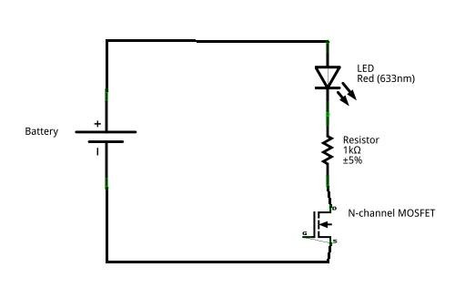
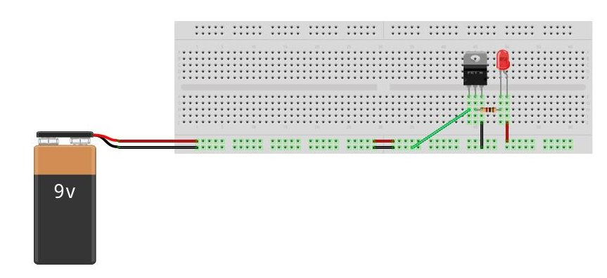
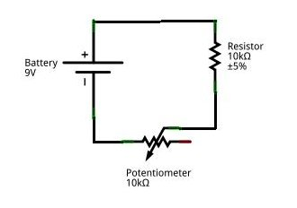
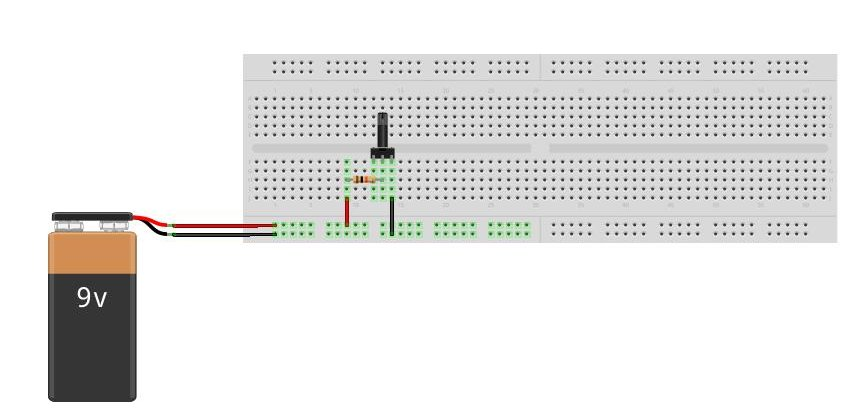
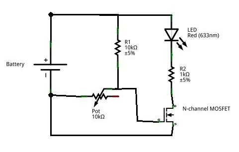
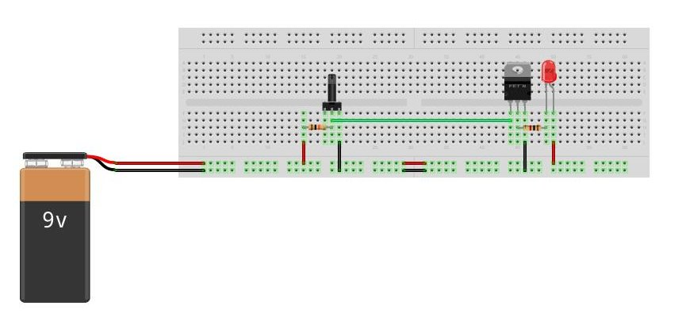

# Introduction to Electronics Lab Activity
In this tutorial you will solder solid-core wire to the leads of a 9v battery connector.
You will then create a circuit to control a Light Emitting Diode (LED) with an N-channel MOSFET (Field Effect Transistor).
Next, you will make a variable voltage source using a potentiometer.
Finally, you will combine the two circuits to make a larger circuit.

### Purpose
This tutorial serves as a basic introduction to soldering, and an introduction to common circuit components like
LEDs, MOSFETs, resistors, and potentiometers.  It also demonstrates circuit concepts like the voltage divider.  Finally,
it demonstrates the fundamental concept of abstraction in circuit design (making small parts of a circuit, testing to
make sure they work, and then combining them as part of a larger circuit).

## MOSFET LED Circuit
This circuit consists of an LED that turns on when the MOSFET is active.  

### Schematic

### Breadboard example

## Potentiometer Voltage Divider
This circuit consists of a potentiometer and resistor in series that act as a variable voltage divider.

### Schematic

### Breadboard example

## Combined Circuit

### Schematic

### Breadboard

